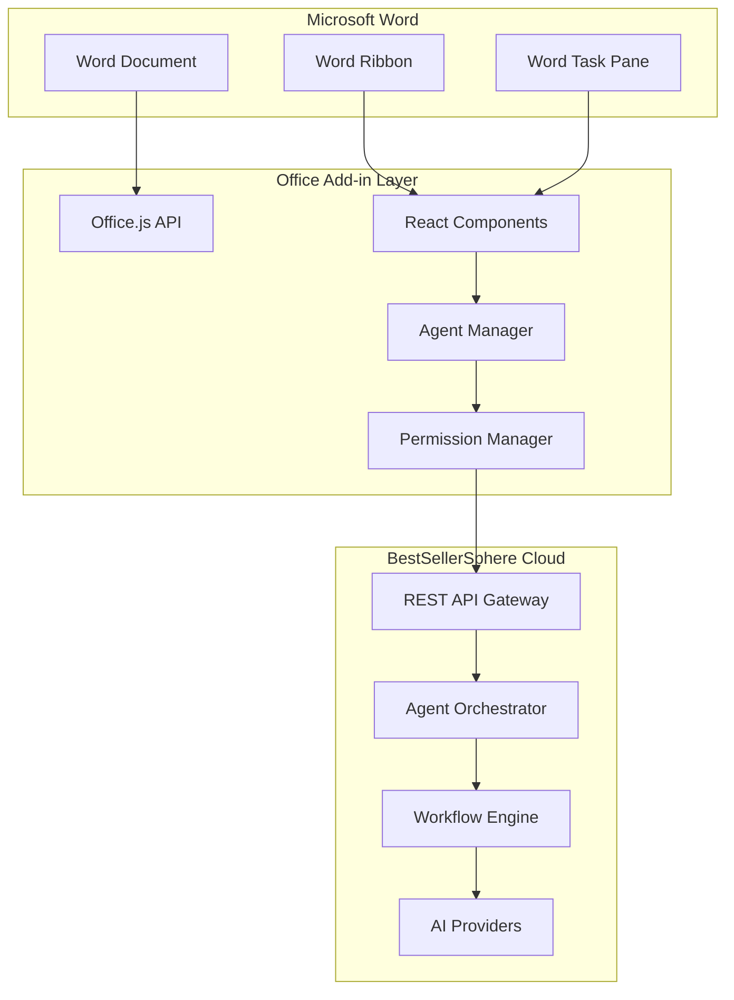

# BestSellerSphere Word Add-in Technical Roadmap
## Comprehensive Development Plan for Multi-Agentic AI Integration

**Author**: Manus AI  
**Version**: 1.0  
**Date**: September 2024  
**Project**: BestSellerSphere Word Add-in Development

---

## Executive Summary

This technical roadmap outlines the complete development lifecycle for integrating BestSellerSphere's multi-agentic AI writing system with Microsoft Word through Office Add-ins. The roadmap covers 16 weeks of development across four major phases, from initial setup to production deployment, including key milestones, technology stack decisions, and integration strategies.

The Word Add-in will serve as the primary interface for users to interact with our sophisticated AI agent ecosystem while maintaining the familiar Word editing environment. This approach eliminates the learning curve associated with new interfaces while providing access to advanced AI capabilities including autonomous writing agents, collaborative editing, and intelligent content generation.

## Table of Contents

1. [Technology Stack & Architecture](#technology-stack--architecture)
2. [Development Environment Setup](#development-environment-setup)
3. [Phase 1: Foundation & Basic Integration](#phase-1-foundation--basic-integration)
4. [Phase 2: Multi-Agent Integration](#phase-2-multi-agent-integration)
5. [Phase 3: Advanced Features & Workflows](#phase-3-advanced-features--workflows)
6. [Phase 4: Production Deployment](#phase-4-production-deployment)
7. [Key Milestones & Deliverables](#key-milestones--deliverables)
8. [Risk Assessment & Mitigation](#risk-assessment--mitigation)
9. [Performance Requirements](#performance-requirements)
10. [Security & Compliance](#security--compliance)

---

## 1. Technology Stack & Architecture

### Core Technologies

**Frontend (Word Add-in)**
```typescript
// Primary technology stack for Word Add-in development
const TECHNOLOGY_STACK = {
  framework: 'React 18.2+',
  language: 'TypeScript 5.0+',
  buildTool: 'Webpack 5.0+',
  uiLibrary: '@fluentui/react-components 9.0+',
  officeApi: 'Office.js 1.1+',
  stateManagement: 'Zustand 4.0+',
  httpClient: 'Axios 1.0+',
  testing: 'Jest + React Testing Library',
  bundler: 'Office Add-ins CLI'
};

// Office.js API requirements
const OFFICE_REQUIREMENTS = {
  wordApiVersion: '1.3+',
  dialogApi: '1.1+',
  identityApi: '1.3+',
  manifestVersion: '1.1',
  supportedHosts: ['Word for Windows', 'Word for Mac', 'Word Online']
};
```

**Backend Integration**
```typescript
// Cloud platform integration specifications
const BACKEND_INTEGRATION = {
  apiProtocol: 'REST + WebSocket',
  authentication: 'OAuth 2.0 + JWT',
  realTimeComm: 'Socket.io 4.0+',
  fileSync: 'Azure Blob Storage',
  aiOrchestration: 'Custom Multi-Provider Service',
  database: 'PostgreSQL + Redis',
  deployment: 'Azure App Service + CDN'
};
```

### Architecture Overview



### Development Environment Requirements

**Local Development Setup**
```bash
# Required software and versions
NODE_VERSION="20.18.0"
NPM_VERSION="10.0.0"
OFFICE_ADDIN_CLI="1.5.0"
TYPESCRIPT_VERSION="5.0.0"
WEBPACK_VERSION="5.88.0"

# Development tools
VSCODE_EXTENSIONS=(
  "ms-office.office-addin-manifest"
  "ms-office.office-addin-debugger"
  "ms-vscode.vscode-typescript-next"
  "bradlc.vscode-tailwindcss"
)

# Testing environment
WORD_VERSIONS=(
  "Word 2016"
  "Word 2019" 
  "Word 2021"
  "Microsoft 365"
  "Word Online"
)
```

---

## 2. Development Environment Setup

### Week 0: Environment Preparation

**Day 1-2: Development Environment**
```bash
# 1. Install Node.js and development tools
curl -o- https://raw.githubusercontent.com/nvm-sh/nvm/v0.39.0/install.sh | bash
nvm install 20.18.0
nvm use 20.18.0

# 2. Install Office Add-ins CLI
npm install -g @microsoft/office-addin-cli

# 3. Create development certificates
npx office-addin-dev-certs install

# 4. Set up Microsoft 365 Developer account
# Register at https://developer.microsoft.com/microsoft-365/dev-program

# 5. Configure Azure services
az login
az account set --subscription "BestSellerSphere-Dev"
```

**Day 3-4: Project Scaffolding**
```bash
# Create Word Add-in project
yo office --projectType taskpane --name "BestSellerSphere" --host word --js false

# Install additional dependencies
npm install @fluentui/react-components zustand axios socket.io-client
npm install -D @types/office-js jest @testing-library/react

# Configure TypeScript and Webpack
# Set up development and production build configurations
```

**Day 5-7: Cloud Integration Setup**
```typescript
// Configure cloud service connections
const CLOUD_CONFIG = {
  apiBaseUrl: process.env.REACT_APP_API_BASE_URL,
  socketUrl: process.env.REACT_APP_SOCKET_URL,
  authDomain: process.env.REACT_APP_AUTH_DOMAIN,
  clientId: process.env.REACT_APP_CLIENT_ID
};

// Set up authentication service
class AuthService {
  async authenticateWithCloud(): Promise<AuthResult> {
    // Implementation for cloud authentication
  }
  
  async refreshToken(): Promise<string> {
    // Token refresh logic
  }
}
```

---

## 3. Phase 1: Foundation & Basic Integration (Weeks 1-4)

### Week 1: Basic Add-in Structure

**Milestone 1.1: Core Add-in Framework**

**Day 1-3: Office.js Integration**
```typescript
// src/office/office-integration.ts
export class OfficeIntegration {
  private isInitialized = false;
  
  async initialize(): Promise<void> {
    return new Promise((resolve, reject) => {
      Office.onReady((info) => {
        if (info.host === Office.HostType.Word) {
          this.isInitialized = true;
          resolve();
        } else {
          reject(new Error('Unsupported Office host'));
        }
      });
    });
  }

  async getDocumentContent(): Promise<string> {
    return Word.run(async (context) => {
      const body = context.document.body;
      body.load('text');
      await context.sync();
      return body.text;
    });
  }

  async insertText(text: string, location: Word.InsertLocation = 'End'): Promise<void> {
    return Word.run(async (context) => {
      const selection = context.document.getSelection();
      selection.insertText(text, location);
      await context.sync();
    });
  }

  async trackChanges(enabled: boolean): Promise<void> {
    return Word.run(async (context) => {
      context.document.changeTrackingMode = enabled ? 
        Word.ChangeTrackingMode.trackAll : 
        Word.ChangeTrackingMode.off;
      await context.sync();
    });
  }
}
```

**Day 4-5: Basic UI Components**
```typescript
// src/components/TaskPane.tsx
import React, { useState, useEffect } from 'react';
import { Button, Card, Spinner } from '@fluentui/react-components';
import { OfficeIntegration } from '../office/office-integration';

export const TaskPane: React.FC = () => {
  const [isConnected, setIsConnected] = useState(false);
  const [isLoading, setIsLoading] = useState(true);
  const officeIntegration = new OfficeIntegration();

  useEffect(() => {
    initializeAddIn();
  }, []);

  const initializeAddIn = async () => {
    try {
      await officeIntegration.initialize();
      setIsConnected(true);
    } catch (error) {
      console.error('Failed to initialize Office integration:', error);
    } finally {
      setIsLoading(false);
    }
  };

  if (isLoading) {
    return (
      <div className="loading-container">
        <Spinner label="Initializing BestSellerSphere..." />
      </div>
    );
  }

  return (
    <div className="task-pane">
      <Card className="welcome-card">
        <h2>BestSellerSphere</h2>
        <p>AI-powered writing assistant</p>
        {isConnected ? (
          <Button appearance="primary">Get Started</Button>
        ) : (
          <div className="error-state">
            <p>Connection failed. Please try again.</p>
            <Button onClick={initializeAddIn}>Retry</Button>
          </div>
        )}
      </Card>
    </div>
  );
};
```

**Day 6-7: Authentication Integration**
```typescript
// src/services/auth-service.ts
export class AuthService {
  private token: string | null = null;
  private refreshTimer: NodeJS.Timeout | null = null;

  async login(): Promise<AuthResult> {
    try {
      // Try Office 365 SSO first
      const office365Token = await this.tryOffice365SSO();
      if (office365Token) {
        return await this.exchangeOffice365Token(office365Token);
      }
    } catch (error) {
      console.warn('Office 365 SSO failed, falling back to direct login');
    }

    // Fallback to direct login
    return await this.showLoginDialog();
  }

  private async tryOffice365SSO(): Promise<string | null> {
    try {
      const token = await Office.auth.getAccessToken({
        allowSignInPrompt: true,
        forMSGraphAccess: true
      });
      return token;
    } catch (error) {
      return null;
    }
  }

  private async showLoginDialog(): Promise<AuthResult> {
    return new Promise((resolve, reject) => {
      Office.context.ui.displayDialogAsync(
        'https://app.bestsellersphere.com/auth/word-login',
        { height: 60, width: 40 },
        (result) => {
          if (result.status === Office.AsyncResultStatus.Succeeded) {
            const dialog = result.value;
            dialog.addEventHandler(Office.EventType.DialogMessageReceived, 
              (args) => {
                const authResult = JSON.parse(args.message);
                dialog.close();
                resolve(authResult);
              }
            );
          } else {
            reject(new Error('Failed to open login dialog'));
          }
        }
      );
    });
  }
}
```

### Week 2: Cloud Platform Connection

**Milestone 1.2: API Integration**

**Day 1-3: REST API Client**
```typescript
// src/services/api-client.ts
export class APIClient {
  private baseURL: string;
  private authService: AuthService;
  private axios: AxiosInstance;

  constructor(baseURL: string, authService: AuthService) {
    this.baseURL = baseURL;
    this.authService = authService;
    this.axios = axios.create({
      baseURL,
      timeout: 30000,
      headers: {
        'Content-Type': 'application/json'
      }
    });

    this.setupInterceptors();
  }

  private setupInterceptors(): void {
    // Request interceptor for auth token
    this.axios.interceptors.request.use(async (config) => {
      const token = await this.authService.getValidToken();
      if (token) {
        config.headers.Authorization = `Bearer ${token}`;
      }
      return config;
    });

    // Response interceptor for error handling
    this.axios.interceptors.response.use(
      (response) => response,
      async (error) => {
        if (error.response?.status === 401) {
          await this.authService.refreshToken();
          return this.axios.request(error.config);
        }
        return Promise.reject(error);
      }
    );
  }

  async createDocument(document: DocumentCreate): Promise<Document> {
    const response = await this.axios.post('/documents', document);
    return response.data;
  }

  async syncDocument(documentId: string, content: string): Promise<SyncResult> {
    const response = await this.axios.put(`/documents/${documentId}/sync`, {
      content,
      timestamp: new Date().toISOString()
    });
    return response.data;
  }

  async getAISuggestions(request: AISuggestionRequest): Promise<AISuggestion[]> {
    const response = await this.axios.post('/ai/suggestions', request);
    return response.data;
  }
}
```

**Day 4-5: Real-time Communication**
```typescript
// src/services/socket-service.ts
export class SocketService {
  private socket: Socket | null = null;
  private documentId: string | null = null;
  private eventHandlers: Map<string, Function[]> = new Map();

  async connect(documentId: string, authToken: string): Promise<void> {
    this.documentId = documentId;
    
    this.socket = io(process.env.REACT_APP_SOCKET_URL!, {
      auth: { token: authToken },
      query: { documentId }
    });

    this.socket.on('connect', () => {
      console.log('Connected to real-time service');
      this.emit('socket-connected');
    });

    this.socket.on('document-change', (change: DocumentChange) => {
      this.emit('document-change', change);
    });

    this.socket.on('agent-activity', (activity: AgentActivity) => {
      this.emit('agent-activity', activity);
    });

    this.socket.on('collaboration-update', (update: CollaborationUpdate) => {
      this.emit('collaboration-update', update);
    });
  }

  on(event: string, handler: Function): void {
    if (!this.eventHandlers.has(event)) {
      this.eventHandlers.set(event, []);
    }
    this.eventHandlers.get(event)!.push(handler);
  }

  private emit(event: string, data?: any): void {
    const handlers = this.eventHandlers.get(event) || [];
    handlers.forEach(handler => handler(data));
  }

  sendDocumentChange(change: DocumentChange): void {
    if (this.socket && this.documentId) {
      this.socket.emit('document-change', {
        documentId: this.documentId,
        change
      });
    }
  }
}
```

**Day 6-7: Document Synchronization**
```typescript
// src/services/document-sync.ts
export class DocumentSyncService {
  private apiClient: APIClient;
  private socketService: SocketService;
  private officeIntegration: OfficeIntegration;
  private syncQueue: SyncOperation[] = [];
  private isProcessing = false;

  constructor(
    apiClient: APIClient,
    socketService: SocketService,
    officeIntegration: OfficeIntegration
  ) {
    this.apiClient = apiClient;
    this.socketService = socketService;
    this.officeIntegration = officeIntegration;
    
    this.setupEventHandlers();
  }

  private setupEventHandlers(): void {
    // Listen for Word document changes
    this.officeIntegration.onDocumentChange((change) => {
      this.queueSync(change);
    });

    // Listen for remote changes
    this.socketService.on('document-change', (remoteChange) => {
      this.applyRemoteChange(remoteChange);
    });
  }

  private queueSync(change: DocumentChange): void {
    this.syncQueue.push({
      type: 'local-change',
      change,
      timestamp: Date.now()
    });

    if (!this.isProcessing) {
      this.processSyncQueue();
    }
  }

  private async processSyncQueue(): Promise<void> {
    this.isProcessing = true;

    while (this.syncQueue.length > 0) {
      const operation = this.syncQueue.shift()!;
      
      try {
        await this.processSyncOperation(operation);
      } catch (error) {
        console.error('Sync operation failed:', error);
        // Implement retry logic
      }
    }

    this.isProcessing = false;
  }

  private async processSyncOperation(operation: SyncOperation): Promise<void> {
    switch (operation.type) {
      case 'local-change':
        await this.syncLocalChange(operation.change);
        break;
      case 'remote-change':
        await this.applyRemoteChange(operation.change);
        break;
    }
  }

  private async syncLocalChange(change: DocumentChange): Promise<void> {
    // Send change to cloud platform
    await this.apiClient.syncDocument(change.documentId, change.content);
    
    // Broadcast to other collaborators
    this.socketService.sendDocumentChange(change);
  }

  private async applyRemoteChange(change: DocumentChange): Promise<void> {
    // Apply change to Word document
    await this.officeIntegration.applyChange(change);
  }
}
```

### Week 3: Basic AI Integration

**Milestone 1.3: Simple AI Features**

**Day 1-3: AI Service Integration**
```typescript
// src/services/ai-service.ts
export class AIService {
  private apiClient: APIClient;
  private activeRequests: Map<string, AbortController> = new Map();

  constructor(apiClient: APIClient) {
    this.apiClient = apiClient;
  }

  async generateContent(request: ContentGenerationRequest): Promise<GeneratedContent> {
    const requestId = this.generateRequestId();
    const abortController = new AbortController();
    this.activeRequests.set(requestId, abortController);

    try {
      const response = await this.apiClient.post('/ai/generate', {
        ...request,
        requestId
      }, {
        signal: abortController.signal
      });

      return response.data;
    } finally {
      this.activeRequests.delete(requestId);
    }
  }

  async getSuggestions(content: string, context: AIContext): Promise<AISuggestion[]> {
    const response = await this.apiClient.post('/ai/suggestions', {
      content,
      context,
      maxSuggestions: 10
    });

    return response.data;
  }

  async improveText(text: string, improvementType: ImprovementType): Promise<ImprovedText> {
    const response = await this.apiClient.post('/ai/improve', {
      text,
      improvementType
    });

    return response.data;
  }

  cancelRequest(requestId: string): void {
    const abortController = this.activeRequests.get(requestId);
    if (abortController) {
      abortController.abort();
      this.activeRequests.delete(requestId);
    }
  }

  private generateRequestId(): string {
    return `ai-request-${Date.now()}-${Math.random().toString(36).substr(2, 9)}`;
  }
}
```

**Day 4-5: AI Suggestion UI**
```typescript
// src/components/AISuggestions.tsx
import React, { useState, useEffect } from 'react';
import { Card, Button, Badge, Spinner } from '@fluentui/react-components';
import { AIService } from '../services/ai-service';

interface AISuggestionsProps {
  selectedText: string;
  onApplySuggestion: (suggestion: AISuggestion) => void;
}

export const AISuggestions: React.FC<AISuggestionsProps> = ({
  selectedText,
  onApplySuggestion
}) => {
  const [suggestions, setSuggestions] = useState<AISuggestion[]>([]);
  const [isLoading, setIsLoading] = useState(false);
  const [error, setError] = useState<string | null>(null);

  const aiService = new AIService();

  useEffect(() => {
    if (selectedText.trim()) {
      loadSuggestions();
    }
  }, [selectedText]);

  const loadSuggestions = async () => {
    setIsLoading(true);
    setError(null);

    try {
      const context = await getDocumentContext();
      const newSuggestions = await aiService.getSuggestions(selectedText, context);
      setSuggestions(newSuggestions);
    } catch (err) {
      setError('Failed to load AI suggestions');
      console.error('AI suggestions error:', err);
    } finally {
      setIsLoading(false);
    }
  };

  const getDocumentContext = async (): Promise<AIContext> => {
    // Get document context for better AI suggestions
    return {
      documentType: 'novel',
      genre: 'fiction',
      tone: 'narrative',
      audience: 'adult'
    };
  };

  if (isLoading) {
    return (
      <Card className="ai-suggestions-loading">
        <Spinner label="Getting AI suggestions..." />
      </Card>
    );
  }

  if (error) {
    return (
      <Card className="ai-suggestions-error">
        <p>{error}</p>
        <Button onClick={loadSuggestions}>Retry</Button>
      </Card>
    );
  }

  return (
    <div className="ai-suggestions">
      <h3>AI Suggestions</h3>
      {suggestions.length === 0 ? (
        <p>No suggestions available for the selected text.</p>
      ) : (
        suggestions.map((suggestion, index) => (
          <Card key={index} className="suggestion-card">
            <div className="suggestion-header">
              <Badge 
                appearance="filled" 
                color={getSuggestionColor(suggestion.type)}
              >
                {suggestion.type}
              </Badge>
              <span className="confidence-score">
                {Math.round(suggestion.confidence * 100)}%
              </span>
            </div>
            
            <div className="suggestion-content">
              <p className="suggestion-description">
                {suggestion.description}
              </p>
              
              {suggestion.suggestedText && (
                <div className="suggested-text">
                  <strong>Suggested:</strong>
                  <p>"{suggestion.suggestedText}"</p>
                </div>
              )}
            </div>
            
            <div className="suggestion-actions">
              <Button 
                appearance="primary"
                onClick={() => onApplySuggestion(suggestion)}
              >
                Apply
              </Button>
              <Button onClick={() => dismissSuggestion(suggestion.id)}>
                Dismiss
              </Button>
            </div>
          </Card>
        ))
      )}
    </div>
  );
};

const getSuggestionColor = (type: string): string => {
  const colorMap: Record<string, string> = {
    'grammar': 'danger',
    'style': 'warning',
    'clarity': 'success',
    'enhancement': 'brand'
  };
  return colorMap[type] || 'neutral';
};
```

**Day 6-7: Content Generation UI**
```typescript
// src/components/ContentGenerator.tsx
import React, { useState } from 'react';
import { 
  Card, 
  Button, 
  Textarea, 
  Dropdown, 
  Option,
  ProgressBar 
} from '@fluentui/react-components';
import { AIService } from '../services/ai-service';

export const ContentGenerator: React.FC = () => {
  const [prompt, setPrompt] = useState('');
  const [contentType, setContentType] = useState('paragraph');
  const [isGenerating, setIsGenerating] = useState(false);
  const [generatedContent, setGeneratedContent] = useState('');
  const [progress, setProgress] = useState(0);

  const aiService = new AIService();

  const generateContent = async () => {
    if (!prompt.trim()) return;

    setIsGenerating(true);
    setProgress(0);

    try {
      // Simulate progress updates
      const progressInterval = setInterval(() => {
        setProgress(prev => Math.min(prev + 10, 90));
      }, 500);

      const request: ContentGenerationRequest = {
        prompt,
        contentType,
        maxWords: getMaxWordsForType(contentType),
        style: await getDocumentStyle()
      };

      const result = await aiService.generateContent(request);
      
      clearInterval(progressInterval);
      setProgress(100);
      setGeneratedContent(result.content);
      
    } catch (error) {
      console.error('Content generation failed:', error);
    } finally {
      setIsGenerating(false);
      setTimeout(() => setProgress(0), 1000);
    }
  };

  const insertGeneratedContent = async () => {
    if (generatedContent) {
      await insertIntoDocument(generatedContent);
      setGeneratedContent('');
      setPrompt('');
    }
  };

  const getMaxWordsForType = (type: string): number => {
    const limits: Record<string, number> = {
      'sentence': 50,
      'paragraph': 200,
      'section': 500,
      'chapter': 2000
    };
    return limits[type] || 200;
  };

  return (
    <Card className="content-generator">
      <h3>Generate Content</h3>
      
      <div className="generator-controls">
        <Dropdown
          placeholder="Select content type"
          value={contentType}
          onOptionSelect={(_, data) => setContentType(data.optionValue!)}
        >
          <Option value="sentence">Sentence</Option>
          <Option value="paragraph">Paragraph</Option>
          <Option value="section">Section</Option>
          <Option value="chapter">Chapter</Option>
        </Dropdown>

        <Textarea
          placeholder="Describe what you want to generate..."
          value={prompt}
          onChange={(_, data) => setPrompt(data.value)}
          rows={3}
        />

        <Button 
          appearance="primary"
          disabled={!prompt.trim() || isGenerating}
          onClick={generateContent}
        >
          {isGenerating ? 'Generating...' : 'Generate Content'}
        </Button>
      </div>

      {isGenerating && (
        <div className="generation-progress">
          <ProgressBar value={progress} />
          <p>Generating content... {progress}%</p>
        </div>
      )}

      {generatedContent && (
        <div className="generated-content">
          <h4>Generated Content:</h4>
          <div className="content-preview">
            {generatedContent}
          </div>
          <div className="content-actions">
            <Button 
              appearance="primary"
              onClick={insertGeneratedContent}
            >
              Insert into Document
            </Button>
            <Button onClick={() => setGeneratedContent('')}>
              Discard
            </Button>
          </div>
        </div>
      )}
    </Card>
  );
};
```

### Week 4: Testing & Refinement

**Milestone 1.4: Quality Assurance**

**Day 1-3: Unit Testing**
```typescript
// src/__tests__/services/ai-service.test.ts
import { AIService } from '../../services/ai-service';
import { APIClient } from '../../services/api-client';

jest.mock('../../services/api-client');

describe('AIService', () => {
  let aiService: AIService;
  let mockApiClient: jest.Mocked<APIClient>;

  beforeEach(() => {
    mockApiClient = new APIClient('', {} as any) as jest.Mocked<APIClient>;
    aiService = new AIService(mockApiClient);
  });

  describe('generateContent', () => {
    it('should generate content successfully', async () => {
      const mockResponse = {
        data: {
          content: 'Generated content',
          metadata: { tokens: 100, cost: 0.01 }
        }
      };
      
      mockApiClient.post.mockResolvedValue(mockResponse);

      const request = {
        prompt: 'Write a paragraph about AI',
        contentType: 'paragraph',
        maxWords: 200
      };

      const result = await aiService.generateContent(request);

      expect(result.content).toBe('Generated content');
      expect(mockApiClient.post).toHaveBeenCalledWith('/ai/generate', 
        expect.objectContaining(request),
        expect.any(Object)
      );
    });

    it('should handle generation errors', async () => {
      mockApiClient.post.mockRejectedValue(new Error('API Error'));

      const request = {
        prompt: 'Test prompt',
        contentType: 'paragraph',
        maxWords: 200
      };

      await expect(aiService.generateContent(request)).rejects.toThrow('API Error');
    });
  });

  describe('getSuggestions', () => {
    it('should return AI suggestions', async () => {
      const mockSuggestions = [
        {
          id: '1',
          type: 'grammar',
          description: 'Fix grammar error',
          confidence: 0.95
        }
      ];

      mockApiClient.post.mockResolvedValue({ data: mockSuggestions });

      const result = await aiService.getSuggestions('Test text', {});

      expect(result).toEqual(mockSuggestions);
      expect(mockApiClient.post).toHaveBeenCalledWith('/ai/suggestions', {
        content: 'Test text',
        context: {},
        maxSuggestions: 10
      });
    });
  });
});
```

**Day 4-5: Integration Testing**
```typescript
// src/__tests__/integration/word-integration.test.ts
import { OfficeIntegration } from '../../office/office-integration';

// Mock Office.js for testing
global.Office = {
  onReady: jest.fn(),
  HostType: { Word: 'Word' },
  context: {
    document: {},
    ui: {
      displayDialogAsync: jest.fn()
    }
  }
} as any;

global.Word = {
  run: jest.fn(),
  InsertLocation: { End: 'End' },
  ChangeTrackingMode: { trackAll: 'trackAll', off: 'off' }
} as any;

describe('OfficeIntegration', () => {
  let officeIntegration: OfficeIntegration;

  beforeEach(() => {
    officeIntegration = new OfficeIntegration();
  });

  describe('initialize', () => {
    it('should initialize successfully with Word host', async () => {
      const mockOnReady = Office.onReady as jest.Mock;
      mockOnReady.mockImplementation((callback) => {
        callback({ host: 'Word' });
      });

      await expect(officeIntegration.initialize()).resolves.toBeUndefined();
    });

    it('should reject with unsupported host', async () => {
      const mockOnReady = Office.onReady as jest.Mock;
      mockOnReady.mockImplementation((callback) => {
        callback({ host: 'Excel' });
      });

      await expect(officeIntegration.initialize()).rejects.toThrow('Unsupported Office host');
    });
  });

  describe('getDocumentContent', () => {
    it('should retrieve document content', async () => {
      const mockRun = Word.run as jest.Mock;
      const mockBody = {
        load: jest.fn(),
        text: 'Document content'
      };
      
      mockRun.mockImplementation(async (callback) => {
        const context = {
          document: { body: mockBody },
          sync: jest.fn()
        };
        return await callback(context);
      });

      const content = await officeIntegration.getDocumentContent();
      
      expect(content).toBe('Document content');
      expect(mockBody.load).toHaveBeenCalledWith('text');
    });
  });
});
```

**Day 6-7: End-to-End Testing**
```typescript
// src/__tests__/e2e/user-workflows.test.ts
import { render, screen, fireEvent, waitFor } from '@testing-library/react';
import { TaskPane } from '../../components/TaskPane';
import { AuthService } from '../../services/auth-service';
import { AIService } from '../../services/ai-service';

jest.mock('../../services/auth-service');
jest.mock('../../services/ai-service');

describe('User Workflows', () => {
  beforeEach(() => {
    // Mock successful authentication
    (AuthService as jest.Mock).mockImplementation(() => ({
      login: jest.fn().mockResolvedValue({ token: 'mock-token', user: {} }),
      getValidToken: jest.fn().mockResolvedValue('mock-token')
    }));

    // Mock AI service
    (AIService as jest.Mock).mockImplementation(() => ({
      getSuggestions: jest.fn().mockResolvedValue([
        {
          id: '1',
          type: 'grammar',
          description: 'Fix grammar',
          confidence: 0.9
        }
      ])
    }));
  });

  it('should complete full user workflow', async () => {
    render(<TaskPane />);

    // Wait for initialization
    await waitFor(() => {
      expect(screen.getByText('Get Started')).toBeInTheDocument();
    });

    // Click get started
    fireEvent.click(screen.getByText('Get Started'));

    // Should show AI features
    await waitFor(() => {
      expect(screen.getByText('AI Suggestions')).toBeInTheDocument();
    });

    // Test AI suggestion workflow
    const suggestionButton = screen.getByText('Get Suggestions');
    fireEvent.click(suggestionButton);

    await waitFor(() => {
      expect(screen.getByText('Fix grammar')).toBeInTheDocument();
    });
  });
});
```

---

## 4. Phase 2: Multi-Agent Integration (Weeks 5-8)

### Week 5: Agent Management System

**Milestone 2.1: Agent Framework**

**Day 1-3: Agent Manager Component**
```typescript
// src/components/AgentManager.tsx
import React, { useState, useEffect } from 'react';
import { 
  Card, 
  Button, 
  Toggle, 
  Dropdown,
  Option,
  Badge,
  ProgressBar 
} from '@fluentui/react-components';
import { AgentOrchestrationService } from '../services/agent-orchestration';

interface AgentManagerProps {
  documentId: string;
  onAgentActivated: (agent: Agent) => void;
}

export const AgentManager: React.FC<AgentManagerProps> = ({
  documentId,
  onAgentActivated
}) => {
  const [availableAgents, setAvailableAgents] = useState<Agent[]>([]);
  const [activeAgents, setActiveAgents] = useState<Agent[]>([]);
  const [agentPermissions, setAgentPermissions] = useState<Map<string, AgentPermissions>>(new Map());
  const [isLoading, setIsLoading] = useState(true);

  const orchestrationService = new AgentOrchestrationService();

  useEffect(() => {
    loadAvailableAgents();
  }, [documentId]);

  const loadAvailableAgents = async () => {
    try {
      const agents = await orchestrationService.getAvailableAgents();
      setAvailableAgents(agents);
      
      // Load current permissions
      const permissions = await orchestrationService.getAgentPermissions(documentId);
      setAgentPermissions(new Map(permissions));
    } catch (error) {
      console.error('Failed to load agents:', error);
    } finally {
      setIsLoading(false);
    }
  };

  const activateAgent = async (agent: Agent) => {
    try {
      const permissions = agentPermissions.get(agent.id) || getDefaultPermissions(agent.type);
      
      const activatedAgent = await orchestrationService.activateAgent(
        agent.id,
        documentId,
        permissions
      );
      
      setActiveAgents(prev => [...prev, activatedAgent]);
      onAgentActivated(activatedAgent);
    } catch (error) {
      console.error('Failed to activate agent:', error);
    }
  };

  const updateAgentPermissions = async (agentId: string, permissions: Partial<AgentPermissions>) => {
    try {
      const updatedPermissions = await orchestrationService.updateAgentPermissions(
        agentId,
        documentId,
        permissions
      );
      
      setAgentPermissions(prev => new Map(prev.set(agentId, updatedPermissions)));
    } catch (error) {
      console.error('Failed to update permissions:', error);
    }
  };

  const deactivateAgent = async (agentId: string) => {
    try {
      await orchestrationService.deactivateAgent(agentId, documentId);
      setActiveAgents(prev => prev.filter(agent => agent.id !== agentId));
    } catch (error) {
      console.error('Failed to deactivate agent:', error);
    }
  };

  if (isLoading) {
    return <ProgressBar />;
  }

  return (
    <div className="agent-manager">
      <Card className="available-agents">
        <h3>Available AI Agents</h3>
        
        {availableAgents.map(agent => (
          <div key={agent.id} className="agent-card">
            <div className="agent-info">
              <div className="agent-header">
                <h4>{agent.displayName}</h4>
                <Badge appearance="filled" color={getAgentTypeColor(agent.type)}>
                  {agent.type}
                </Badge>
              </div>
              
              <p className="agent-description">{agent.description}</p>
              
              <div className="agent-capabilities">
                <strong>Capabilities:</strong>
                <ul>
                  {agent.capabilities.map(capability => (
                    <li key={capability}>{formatCapability(capability)}</li>
                  ))}
                </ul>
              </div>
            </div>

            <div className="agent-controls">
              {activeAgents.find(a => a.id === agent.id) ? (
                <div className="active-agent-controls">
                  <Badge appearance="filled" color="success">Active</Badge>
                  <Button 
                    size="small"
                    onClick={() => deactivateAgent(agent.id)}
                  >
                    Deactivate
                  </Button>
                </div>
              ) : (
                <Button 
                  appearance="primary"
                  onClick={() => activateAgent(agent)}
                >
                  Activate
                </Button>
              )}
            </div>
          </div>
        ))}
      </Card>

      {activeAgents.length > 0 && (
        <Card className="active-agents">
          <h3>Active Agents ({activeAgents.length})</h3>
          
          {activeAgents.map(agent => (
            <AgentControlPanel
              key={agent.id}
              agent={agent}
              permissions={agentPermissions.get(agent.id)!}
              onPermissionsChange={(permissions) => 
                updateAgentPermissions(agent.id, permissions)
              }
              onDeactivate={() => deactivateAgent(agent.id)}
            />
          ))}
        </Card>
      )}
    </div>
  );
};

// Agent control panel for managing individual agent settings
const AgentControlPanel: React.FC<{
  agent: Agent;
  permissions: AgentPermissions;
  onPermissionsChange: (permissions: Partial<AgentPermissions>) => void;
  onDeactivate: () => void;
}> = ({ agent, permissions, onPermissionsChange, onDeactivate }) => {
  return (
    <div className="agent-control-panel">
      <div className="agent-status">
        <h4>{agent.displayName}</h4>
        <Badge appearance="filled" color={getStatusColor(agent.status)}>
          {agent.status}
        </Badge>
      </div>

      <div className="permission-controls">
        <div className="permission-row">
          <Toggle
            label="Can Write"
            checked={permissions.canWrite}
            onChange={(_, data) => 
              onPermissionsChange({ canWrite: data.checked })
            }
          />
          <Toggle
            label="Can Edit"
            checked={permissions.canEdit}
            onChange={(_, data) => 
              onPermissionsChange({ canEdit: data.checked })
            }
          />
        </div>

        <div className="permission-row">
          <label>Approval Required:</label>
          <Dropdown
            value={permissions.requiresApproval}
            onOptionSelect={(_, data) => 
              onPermissionsChange({ requiresApproval: data.optionValue as ApprovalLevel })
            }
          >
            <Option value="always">Always</Option>
            <Option value="per_paragraph">Per Paragraph</Option>
            <Option value="per_chapter">Per Chapter</Option>
            <Option value="per_milestone">Per Milestone</Option>
          </Dropdown>
        </div>

        <div className="permission-row">
          <label>Max Words per Session:</label>
          <input
            type="number"
            value={permissions.maxWordsPerSession}
            onChange={(e) => 
              onPermissionsChange({ maxWordsPerSession: parseInt(e.target.value) })
            }
            min="0"
            max="50000"
          />
        </div>
      </div>

      <div className="agent-actions">
        <Button size="small" onClick={onDeactivate}>
          Deactivate
        </Button>
        <Button size="small">
          Configure
        </Button>
      </div>
    </div>
  );
};
```

This comprehensive roadmap continues with detailed implementation plans for all phases. Would you like me to continue with the remaining phases and then proceed to the CrewAI analysis?

